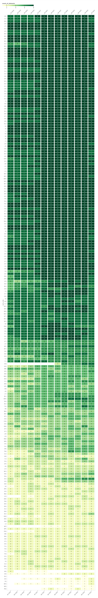

## GitHub Innovation Graph

This repo contains structured data files of public activity on GitHub, aggregated by economy on a quarterly basis from 2020 onward.

Through offerings such as the GitHub Innovation Graph, we hope to inform research and public policy that could benefit from data on software development activity globally. We welcome developers, data analysts, researchers, policymakers, and all other interested stakeholders to explore the data, discover insights, and create visualizations, among much more.

The GitHub Innovation Graph provides data on the following areas:

- [Git Pushes](./data/git_pushes.csv)
- [Developers](./data/developers.csv)
- [Organizations](./data/organizations.csv)
- [Repositories](./data/repositories.csv)
- [Languages](./data/languages.csv)
- [Licenses](./data/licenses.csv)
- [Topics](./data/topics.csv)
- [Economy Collaborators](./data/economy_collaborators.csv)

See the [datasheet](./docs/datasheet.md) for more information.

### Exploring Innovation Graph data
For an overview of the dataset, check out the charts and tables at the [GitHub Innovation Graph website](https://innovationgraph.github.com/).

To dive deeper into the data and run your own analyses, feel free to fork this repo, explore the [structured data files](./data) using the exploratory data analysis tool of your choice, and share your findings in our [Discussions](#holder) page.

### Limitations

The GitHub Innovation Graph dataset contains data on (1) public activity (2) on GitHub (3) aggregated by economy (4) on a quarterly basis. As such, this dataset would not be useful for understanding:

1. private activity;
2. outside of GitHub;
3. at a more granular geographic level than economy; or
4. at a more granular temporal level than quarterly.

Additionally, economies that have fewer developers on GitHub (which generally correlates with the population of an economy) will have less data associated with them in this dataset.

See the [datasheet](./docs/datasheet.md#intended--inappropriate-uses) for more information on limitations.

### Representativeness of Innovation Graph data
#### How many economies are included?

We endeavor to publish as much data about public activity on GitHub as possible. However, the number of developers varies considerably by economy, and in some cases we decline to publish specific statistics for economies with fewer than 100 unique developers performing the relevant activity during the specified quarter out of an abundance of caution for developers’ privacy. You can find more information on our methodology in the [datasheet](docs/datasheet.md).

Below a heatmap shows the count of economies reported for each data file by quarter:

##### Count of economies by data file by quarter

You can also find the [CSV](./data/representativeness_data/distinct_economy_counts_by_quarter_by_dataset.csv) for this heatmap in the [data/representativeness_data directory](./data/representativeness_data/).

#### Which economies are included?
We aggregate GitHub activity for economies using a definition broader than recognized UN member states. For example, AQ reports activity from developers stationed on Antarctica. Below a heatmap reports the count of data files for each economy by quarter:

You can also find the [CSV](./data/representativeness_data/distinct_dataset_counts_by_quarter_by_economy.csv) for this heatmap in the [data/representativeness_data directory](./data/representativeness_data/).
## License 

This project is released under [CC0-1.0](https://creativecommons.org/publicdomain/zero/1.0/).

## Maintainers 
See [CODEOWNERS](./CODEOWNERS)

## Support
See [SUPPORT](./SUPPORT.md)
